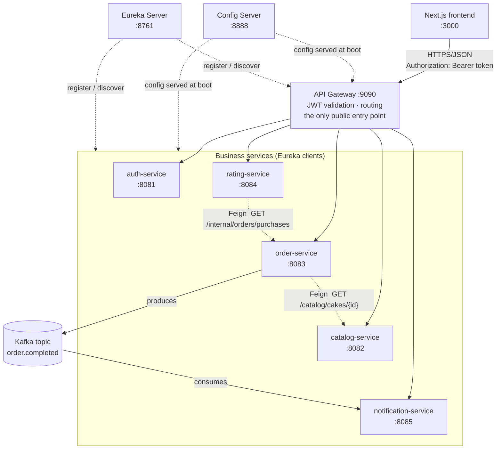

# Cake Delight

A cloud-native cake e-commerce application built as **8 Spring Boot microservices + a Next.js frontend**. It covers the full flow: browse the catalog → filter → add to basket → checkout → receive an order-confirmation notification → rate a purchased cake.

**Stack:** Java 17 · Spring Boot 4.1 · Spring Cloud 2025.1 (Config Server, Eureka, Gateway) · OpenFeign · JWT (HS256) · Spring Data JPA + MySQL 8 · Kafka · Next.js 16 · Docker · Kubernetes.

## Documentation

This README is the architecture and API reference. Three companion documents cover everything else:

- **[run-guide.md](run-guide.md)** — how to run the project locally, with Docker Compose, and on Kubernetes; full environment variable reference; troubleshooting.
- **[db-schema.md](db-schema.md)** — every database, its tables, columns, and relationships.
- **[event-contract.md](event-contract.md)** — the full `order.completed` payload schema, field notes, and versioning approach.

## Table of contents

- [Architecture overview](#architecture-overview)
- [Service catalog](#service-catalog)
- [Tech stack](#tech-stack)
- [Quick start](#quick-start)
- [Configuration](#configuration)
- [API documentation](#api-documentation)
- [Authentication flow](#authentication-flow)
- [Event contract](#event-contract)
- [Data ownership](#data-ownership)
- [Project structure](#project-structure)
- [End-to-end demo flow](#end-to-end-demo-flow)

## Architecture overview



**How a request travels through the system:**

1. The browser (via `frontend-service`) sends every API call to **`api-gateway`** on `:9090` — it never talks to a business service directly.
2. The gateway's `JwtAuthenticationFilter` runs on **every** request. Public routes (catalog browsing, register, login) skip straight through; everything else must carry a valid `Authorization: Bearer <token>`, or the gateway rejects it with `401` before it reaches any business service.
3. For a valid token, the gateway resolves the target service by its logical name through **Eureka** (`lb://catalog-service`, etc.) — there is no hardcoded host/port for any inter-service call anywhere in the system — and forwards the request, having stripped the `/api` prefix and injected `X-User-Id`, `X-User-Role`, and `X-User-Email` headers extracted from the JWT.
4. The downstream service **trusts those headers outright** — it holds no JWT-parsing code and never re-validates the token. `api-gateway` is the system's single trust boundary; authentication (who you are) is decided there, but authorization (what you're allowed to do, e.g. "only an admin may create a cake") is enforced inside the owning service, using the role header.
5. Every service (including the gateway) fetches its own configuration from **Config Server** once, at startup, and registers itself with **Eureka** so the gateway and any Feign caller can find it. Neither Config Server nor Eureka sits on the request path at runtime — both are boot-time dependencies only.
6. `order-service` is the one service that calls another service synchronously and outbound: it calls `catalog-service` via **OpenFeign** to resolve a cake's current price/availability when an item is added to the basket. `rating-service` does the same to `order-service`'s internal-only endpoint, to verify the caller actually purchased the cake before accepting a rating.
7. On a successful checkout, `order-service` publishes an `order.completed` event to **Kafka**; `notification-service` consumes it asynchronously and records a notification. Neither service calls the other synchronously — this is the one place in the system where two services are decoupled by a message broker instead of an API call.

**Why the boundaries are where they are** (loose coupling, by design, not by accident):

- **`config-server`** owns all runtime configuration. It's infrastructure that has to exist before anything else can start, not a peer service.
- **`eureka-server`** owns service discovery — every service is addressed by logical name, never by URL, so any service can move, scale, or change port without any caller's code changing.
- **`api-gateway`** owns routing and the JWT trust boundary. Adding a route or a public path is a config change in `config-repo/`, not a code change or a redeploy of a business service.
- **`auth-service`** owns user identity and password hashes exclusively — no other service can see a password hash, and identity changes (adding SSO, changing the hashing scheme) never touch commerce code.
- **`catalog-service`** owns the cake catalog. It's read-heavy and changes on a completely different cadence from ordering, so it's isolated from the transactional write path.
- **`order-service`** owns baskets *and* orders in one service, deliberately — checkout is a single local transaction that reads a basket and writes an order; splitting them would turn one `@Transactional` boundary into a distributed one.
- **`rating-service`** owns ratings and is intentionally optional/non-critical: if it's down, browsing and checkout are unaffected, because nothing else depends on it synchronously.
- **`notification-service`** owns notification delivery and is purely reactive — it never calls another service synchronously, only consumes Kafka events, which is what keeps a slow or failing email provider from ever being able to block a checkout.
- **`frontend-service`** holds no data and joins none of the Spring Cloud machinery (no Eureka registration, no Config Server) — it's a deployable unit, not a fabric member, and speaks only to `api-gateway`.

Every service also owns its own MySQL schema exclusively — no service ever queries another service's tables (see [Data ownership](#data-ownership)).

## Service catalog

| Service | Port | Purpose | Depends on |
|---|---|---|---|
| `config-server` | 8888 | Serves all runtime configuration from `config-repo/`. Starts first. | — |
| `eureka-server` | 8761 | Service registry / discovery. Starts second. | — |
| `api-gateway` | 9090 | Single public entry point; validates JWTs; routes to business services. | Config Server, Eureka, all 5 business services |
| `auth-service` | 8081 | Registration, login, JWT issuance. | Config Server, Eureka |
| `catalog-service` | 8082 | Cake catalog: browse/filter (public), create/update/delete (admin). | Config Server, Eureka |
| `order-service` | 8083 | Basket CRUD, checkout, order history; publishes `order.completed`. | Config Server, Eureka, `catalog-service` (Feign), Kafka |
| `rating-service` | 8084 | Cake ratings; purchase-gated submission. | Config Server, Eureka, `order-service` (Feign) |
| `notification-service` | 8085 | Consumes `order.completed`; records + sends a notification per order. | Config Server, Eureka, Kafka, SMTP (optional) |
| `frontend-service` | 3000 | Next.js app — the only UI, talks exclusively to `api-gateway`. | `api-gateway` |

## Tech stack

| Category | Technology | Version |
|---|---|---|
| Language / runtime | Java | 17 (LTS) |
| Framework | Spring Boot | 4.1.0 |
| Cloud stack | Spring Cloud (Config, Eureka, Gateway) | 2025.1.2 |
| Gateway variant | `spring-cloud-starter-gateway-server-webmvc` (servlet, not reactive) | — |
| Inter-service calls | OpenFeign | Spring Cloud–managed |
| Auth | JWT (HS256) via `jjwt` (`jjwt-api`/`-impl`/`-jackson`) | 0.12.6 |
| Password hashing | `spring-security-crypto` (BCrypt only — **not** the full Spring Security starter) | Spring Boot–managed |
| Persistence | Spring Data JPA + MySQL | MySQL 8.0 |
| Messaging | Apache Kafka (Confluent images) via `spring-kafka` | `cp-kafka` 7.6.1 / `cp-zookeeper` 7.6.1 |
| API docs | springdoc-openapi (`catalog`, `order`, `rating`, `notification` only) | 3.1.0 |
| Build tool | Maven (each service is its own root, no parent aggregator POM) | 3.9+ |
| Frontend framework | Next.js (App Router, TypeScript) | 16.0.0 |
| Frontend UI | React · Tailwind CSS · shadcn/ui (Radix primitives) | React 19.2.0 · Tailwind v4 |
| Containers | Docker (multi-stage builds, one `Dockerfile` per service) | — |
| Orchestration | Kubernetes (Deployments/Services per component; tested on Docker Desktop's Kubernetes) | — |

## Quick start

**Prerequisites (host-run workflow):** JDK 17, Maven 3.9+, Docker Desktop, Node.js 20+.

Every service reads its configuration from `config-server`, and both the gateway and every business service look each other up through `eureka-server` — so **start order matters**: `config-server` → `eureka-server` → the five business services (any order among themselves) → `api-gateway` last, so it can resolve routes to services that are already registered → `frontend-service`. Config Server and Eureka retry rather than crash if started out of order, but a service that starts before Eureka won't be discoverable until it re-registers.

MySQL (and, from checkout onward, Kafka + Zookeeper) must be up before any business service starts — the bundled `docker-compose.yml` provides both for local development.

Full setup — host/IDE, Docker Compose, and Kubernetes, each with exact commands, ports, and environment variables — is in **[run-guide.md](run-guide.md)**.

## Configuration

All runtime configuration is centralized and never hardcoded in application code:

- **Locally and via Docker Compose**, every service (except `config-server` and `eureka-server` themselves, which are foundational and configure themselves locally) fetches its configuration from **Config Server**, which serves it from the `config-repo/` folder in this repository.
- **On Kubernetes**, the same `config-repo/` content is mounted as a `ConfigMap`, and secrets are injected via a Kubernetes `Secret` instead of a local environment variable — the application code and the shape of the configuration are identical in both environments.
- **The JWT signing secret (`app.jwt.secret`) must be the identical value for `auth-service` (which issues tokens) and `api-gateway` (which validates them).** It lives once, in the *shared* `config-repo/application.properties`, specifically so the two can never drift out of sync.

The full environment variable reference (every `${VAR:default}`, what sets it in each environment, and the two secrets the project uses) is in **[run-guide.md](run-guide.md)**.

## API documentation

All traffic goes through the gateway's base URL, **`http://localhost:9090/api`** — none of the ports in the [service catalog](#service-catalog) above are meant to be called directly by a client (they're reachable directly only for local debugging and Swagger UI).

Interactive API docs (Swagger UI, springdoc) are available directly on each service's own port — not proxied through the gateway:

| Service | Swagger UI |
|---|---|
| `catalog-service` | `http://localhost:8082/swagger-ui.html` |
| `order-service` | `http://localhost:8083/swagger-ui.html` |
| `rating-service` | `http://localhost:8084/swagger-ui.html` |
| `notification-service` | `http://localhost:8085/swagger-ui.html` |

`auth-service` and `api-gateway` have no springdoc dependency and no Swagger UI — their contracts are documented below instead.

Every error response, from every service, uses the same shape:

```json
{
  "timestamp": "2026-08-13T10:15:30Z",
  "status": 409,
  "error": "Conflict",
  "code": "DUPLICATE_RATING",
  "message": "You have already rated this cake",
  "path": "/api/ratings",
  "fieldErrors": null
}
```

`code` is the stable, machine-readable identifier a client should branch on; `fieldErrors` is populated only for a `400` validation failure.

### auth-service

| Method | Path | Auth | Description |
|---|---|---|---|
| POST | `/api/auth/register` | Public | Create a user. Always created with role `CUSTOMER` — there is no self-serve admin signup. |
| POST | `/api/auth/login` | Public | Verify credentials, return a JWT. |

Sample bodies and the token lifecycle are covered in [Authentication flow](#authentication-flow).

### catalog-service

| Method | Path | Auth | Description |
|---|---|---|---|
| GET | `/api/catalog/cakes` | Public | List cakes. Optional filters: `?name=&category=&minPrice=&maxPrice=`. |
| GET | `/api/catalog/cakes/{id}` | Public | Get one cake by id. `404` if it doesn't exist. |
| POST | `/api/catalog/cakes` | Token, `ADMIN` role | Create a cake. |
| PUT | `/api/catalog/cakes/{id}` | Token, `ADMIN` role | Full replace of a cake. |
| DELETE | `/api/catalog/cakes/{id}` | Token, `ADMIN` role | Delete a cake. |

`POST`/`PUT`/`DELETE` are non-obvious because the admin check isn't at the gateway: the gateway lets any authenticated caller through, and `catalog-service` itself rejects non-admins with `403 FORBIDDEN` based on the `X-User-Role` header the gateway injected from the JWT.

<details>
<summary>Sample: <code>POST /api/catalog/cakes</code> (admin token required)</summary>

Request:
```json
{
  "name": "Red Velvet Delight",
  "description": "Classic red velvet with cream cheese frosting",
  "category": "chocolate",
  "price": 650.00,
  "available": true,
  "imageUrl": "https://example.com/images/red-velvet.jpg"
}
```

Response `201 Created`:
```json
{
  "id": 15,
  "name": "Red Velvet Delight",
  "description": "Classic red velvet with cream cheese frosting",
  "category": "chocolate",
  "price": 650.00,
  "available": true,
  "imageUrl": "https://example.com/images/red-velvet.jpg",
  "createdAt": "2026-08-13T10:15:30Z"
}
```
</details>

### order-service

| Method | Path | Auth | Description |
|---|---|---|---|
| GET | `/api/orders/basket` | Token | Get (or auto-create) the caller's basket. |
| POST | `/api/orders/basket/items` | Token | Add a cake to the basket. `404` if the cake doesn't exist, `409` if it's unavailable. |
| PUT | `/api/orders/basket/items/{itemId}` | Token | Update a basket line's quantity. |
| DELETE | `/api/orders/basket/items/{itemId}` | Token | Remove a basket line. |
| POST | `/api/orders/checkout` | Token | Create an order from the basket, publish `order.completed`, clear the basket. `400` if the basket is empty. |
| GET | `/api/orders` | Token | List the caller's own orders. |
| GET | `/api/orders/{id}` | Token | Get one of the caller's own orders. `404` if it isn't theirs. |

`order-service` also exposes `GET /internal/orders/purchases?userId=&cakeId=` — this is **not** reachable through the gateway (there is no `/api/internal/**` route). It exists only for `rating-service`'s Feign client, resolved directly via Eureka, and is what makes purchase-gated rating submission possible without `order-service` and `rating-service` sharing a database.

<details>
<summary>Sample: <code>POST /api/orders/basket/items</code></summary>

Request:
```json
{ "cakeId": 5, "quantity": 2 }
```

Response `201 Created` — non-obvious: adding the **same** `cakeId` a second time increases that line's quantity rather than creating a duplicate line:
```json
{
  "id": 8,
  "userId": 21,
  "items": [
    { "id": 14, "cakeId": 5, "cakeName": "Chocolate Truffle", "unitPrice": 500.00, "quantity": 2, "lineTotal": 1000.00 }
  ],
  "totalAmount": 1000.00
}
```
</details>

<details>
<summary>Sample: <code>POST /api/orders/checkout</code></summary>

No request body. Response `201 Created` — non-obvious: this single call also clears the basket and publishes an `order.completed` Kafka event as a side effect:
```json
{
  "id": 123,
  "userId": 21,
  "totalAmount": 1250.00,
  "status": "CREATED",
  "items": [
    { "id": 201, "cakeId": 5, "cakeName": "Chocolate Truffle", "unitPrice": 500.00, "quantity": 2 }
  ],
  "createdAt": "2026-08-13T10:20:00Z"
}
```
</details>

### rating-service

| Method | Path | Auth | Description |
|---|---|---|---|
| POST | `/api/ratings` | Token | Submit a rating for a cake. |
| GET | `/api/ratings/cakes/{cakeId}` | Token | List ratings for a cake. |
| GET | `/api/ratings/cakes/{cakeId}/summary` | Token | `{ averageRating, totalRatings }` for a cake. |

Unlike catalog browsing, every rating endpoint — including the two `GET`s — requires a token; there is no public-GET carve-out for ratings.

<details>
<summary>Sample: <code>POST /api/ratings</code></summary>

Request:
```json
{ "cakeId": 5, "ratingValue": 5, "reviewText": "Best chocolate cake I've had." }
```

Response `201 Created`:
```json
{ "id": 9, "cakeId": 5, "userId": 21, "ratingValue": 5, "reviewText": "Best chocolate cake I've had.", "createdAt": "2026-08-13T10:25:00Z" }
```

Non-obvious failure modes: `403 CAKE_NOT_PURCHASED` if the caller never checked out that cake (verified via a Feign call to `order-service`'s internal endpoint above), `409 DUPLICATE_RATING` if they've already rated it — one rating per user per cake, enforced by a unique DB constraint.
</details>

### notification-service

| Method | Path | Auth | Description |
|---|---|---|---|
| GET | `/api/notifications` | Token | List the caller's own notifications — one row per completed order, once consumed. |

There is no `POST` here — every notification is created internally by the Kafka consumer described in [Event contract](#event-contract), never via the API.

## Authentication flow

1. **Register**: `POST /api/auth/register` with `{ "email", "password" }` (password 8–100 characters) — creates a `CUSTOMER` user, returns a JWT immediately.
2. **Login**: `POST /api/auth/login` with the same credentials — returns a fresh JWT. Nothing is stored server-side (no session table, no refresh token); the token is self-contained and simply expires.
3. **Token lifetime**: 1 hour from issuance (`exp` claim). After that, the client must log in again — there is no silent refresh.
4. **Use it**: send `Authorization: Bearer <token>` on every subsequent request through the gateway. The gateway checks the signature and expiry in one call, then forwards `X-User-Id`, `X-User-Role`, `X-User-Email` downstream (see [Architecture overview](#architecture-overview), step 4).

```bash
# 1. Register (or log in, if the user already exists)
curl -s -X POST http://localhost:9090/api/auth/register \
  -H "Content-Type: application/json" \
  -d '{"email":"customer@example.com","password":"pa55word!"}'
# -> 201, { "token": "<jwt>", "tokenType": "Bearer", "expiresInMs": 3600000, "email": "customer@example.com", "role": "CUSTOMER" }

# 2. Use the token against a protected endpoint
TOKEN="<jwt from step 1>"
curl -s http://localhost:9090/api/orders/basket \
  -H "Authorization: Bearer $TOKEN"
# -> 200, an empty basket auto-created for this user
```

To exercise the admin-only catalog endpoints, register normally, then set `role='ADMIN'` on that row directly in `auth_db.users` and log in again — there is no self-serve path to the `ADMIN` role, by design.

## Event contract

One Kafka topic in the whole system, `order.completed`. `order-service` produces it — but only *after* the checkout transaction commits (an internal `OrderCheckedOutEvent` triggers a `@TransactionalEventListener(phase = AFTER_COMMIT)`, so a rolled-back checkout never publishes anything); `notification-service` consumes it via `@KafkaListener`, idempotently by `eventId`. The payload is deliberately self-contained — `notification-service` never calls back to another service to enrich it — which is what keeps the two services decoupled by the broker instead of a synchronous dependency.

Full payload schema, field-by-field notes, serialization details, and the versioning approach: **[event-contract.md](event-contract.md)**.

## Data ownership

Each service owns exactly one MySQL schema, and no service ever queries another service's tables — there are no cross-schema foreign keys anywhere in the system. Where one service needs a fact that another owns (a cake's price, whether a user purchased a cake), it asks over the network — a Feign call or, for the order-completion notification, a Kafka event — never the database directly. The full table-by-table schema for all five databases is in **[db-schema.md](db-schema.md)**.

## Project structure

```
cake-delight/
├── config-server/          Spring Cloud Config Server — serves config-repo/
├── eureka-server/          Service registry
├── api-gateway/            Routing + JWT validation (the trust boundary)
├── auth-service/           Users, registration, login, JWT issuance
├── catalog-service/        Cake catalog — browse/filter, admin CRUD
├── order-service/          Basket + checkout + orders; Kafka producer
├── rating-service/         Cake ratings; purchase verification via Feign
├── notification-service/   Kafka consumer; email/log notifications
├── frontend-service/       Next.js app (App Router, TypeScript)
├── config-repo/            Centralized runtime config, served by config-server
├── docker/                 MySQL schema-init scripts for docker-compose
├── docker-compose.yml      Full local stack: MySQL, Kafka, all 9 services
├── k8s/                    Kubernetes manifests (namespace, config, secrets, mysql, kafka, services)
├── run-guide.md            Setup & deployment — local / Docker / Kubernetes
├── db-schema.md            Database schema reference
└── README.md                You are here
```

Every business service (`auth`, `catalog`, `order`, `rating`, `notification`) shares the identical internal package layout: `controller/` → `service/` → `repository/` → `entity/` → `dto/` → `exception/`. `service/` also holds each service's `@FeignClient` interfaces and Kafka producer/listener classes.

## End-to-end demo flow

1. **Register** a user (`POST /api/auth/register`) and **log in** (`POST /api/auth/login`) — keep the JWT.
2. **Browse** the catalog: `GET /api/catalog/cakes` — no token needed.
3. **Filter**: `GET /api/catalog/cakes?category=chocolate&maxPrice=600` — confirm the result set narrows.
4. **Add to basket**: `POST /api/orders/basket/items` with a `cakeId` from step 2. Watch `GET /api/orders/basket` reflect the new line and its `totalAmount`.
5. **Update the quantity**: `PUT /api/orders/basket/items/{itemId}` — confirm `totalAmount` recalculates.
6. **Checkout**: `POST /api/orders/checkout`. Watch for: the response's `status: "CREATED"`, `GET /api/orders/basket` now showing empty, and the new order appearing in `GET /api/orders`.
7. **Observe the notification**: watch `notification-service`'s console for a `order.completed` consumption log line (near-instant locally), then `GET /api/notifications` — one row, `status: "SENT"` (or `"FAILED"` if no SMTP credentials are configured — still recorded, see run-guide.md).
8. **Rate the purchased cake**: `POST /api/ratings` for the `cakeId` from step 4 — succeeds only because it was actually purchased in step 6; the same call before checkout would return `403 CAKE_NOT_PURCHASED`.
9. **Check the average updates**: `GET /api/ratings/cakes/{cakeId}/summary` — `averageRating`/`totalRatings` now reflect the new rating.

---
